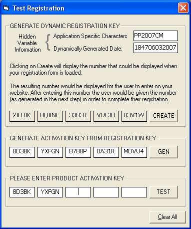



## TestRegistration

### Description

The code generates a dynamic user registration KEY. It can be used like the old Microsoft style where a key is generated, then the user must call in or go to a website to get the final activation KEY based on the first. This is my first submission and it isn't even originally mine. I apologize for that and I will get some of my own original code here soon. Its about time I start paying back all of the great help I've gotten from the codes submitted here on PSC.
 
### More Info
 
I did not develop the code for this. I merely modified the concept of its use and created the user interface. The code was originally submitted to freevbcode.com by Phil Fresle in Sept of 2000.

             |
---                |---
**Submitted On**   |2007-06-03 18:36:02
**By**             |[Chris Mauck](https://github.com/Planet-Source-Code/PSCIndex/blob/master/ByAuthor/chris-mauck.md)
**Level**          |Advanced
**User Rating**    |5.0 (10 globes from 2 users)
**Compatibility**  |VB 6\.0
**Category**       |[Encryption](https://github.com/Planet-Source-Code/PSCIndex/blob/master/ByCategory/encryption__1-48.md)
**World**          |[Visual Basic](https://github.com/Planet-Source-Code/PSCIndex/blob/master/ByWorld/visual-basic.md)
**Archive File**   |[TestRegist206899632007\.zip](https://github.com/Planet-Source-Code/chris-mauck-testregistration__1-68736/archive/master.zip)

